# AWS Infrastructure Setup Guide

This guide will walk you through setting up AWS infrastructure using Packer and Terraform.

## Getting Started

First, clone this repository to your local machine.

## Configure AWS Credentials

Set up your AWS credentials from AWS Academy as environment variables:
```
aws configure
aws configure set aws_session_token <YOUR TOKEN HERE>
```

## Building a Custom AMI with Packer

### Installing Packer
Verify if Packer is installed:
```
packer
```

If not installed, use Homebrew to install it:
```
brew tap hashicorp/tap
brew install hashicorp/tap/packer
```

Install the Amazon plugin:
```
packer plugins install github.com/hashicorp/amazon
```

### Creating SSH Key Pair
Generate an RSA key pair for EC2 access:
```
 aws ec2 create-key-pair \
    --key-name ami-pair \
    --key-type rsa \
    --key-format pem \
    --query "KeyMaterial" \
    --output text > ami-pair.pem
```

Set appropriate permissions for the key file:
```
 chmod 400 ami-pair.pem
```

Note: If you change the key name, update the "ssh_keypair_name" value in ami-pkr-init.json accordingly.

### Building the AMI
Build a custom AMI with Docker and SSH public key configured:
```
 cd packer
 packer build ami-pkr-init.json
```

After completion, you'll see the new AMI ID in the output and can verify it in the AWS Console.
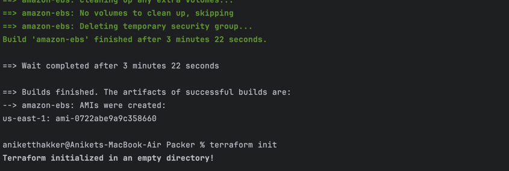
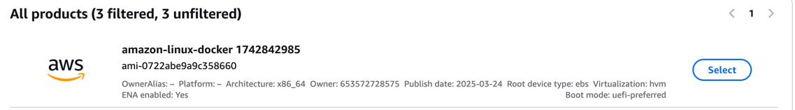

## Deploying Infrastructure with Terraform

### Installing Terraform
Check if Terraform is installed:
```
 terraform
```

If not installed, use Homebrew:
```
 brew tap hashicorp/tap
 brew install hashicorp/tap/terraform
```

### Provisioning Resources
Navigate to the terraform directory and run:
```
 cd terraform
 terraform init
 terraform plan
 terraform apply
```

### Created Resources Overview

After successful deployment, Terraform will create:

1. **VPC Infrastructure**
    - Public subnets connected to the internet via Internet Gateway
    - Private subnets with outbound connectivity via NAT Gateway
    - Associated routing tables, Elastic IPs, and security groups
   
    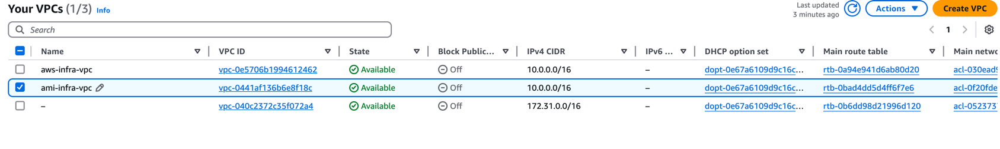

    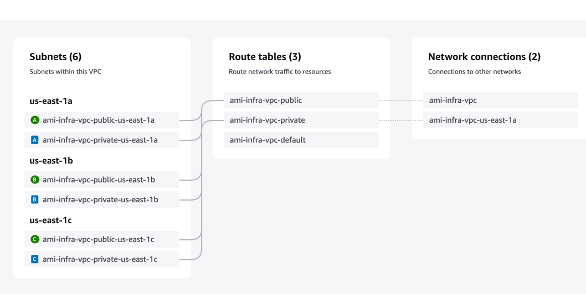

    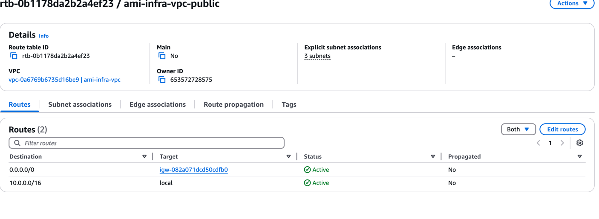

    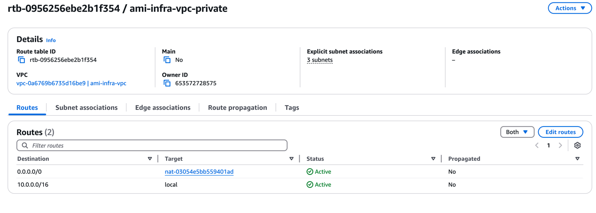

   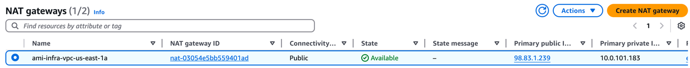
   
2. **EC2 Instances**
    - Bastion host in a public subnet (using Amazon Linux 2023)
    - Custom EC2 instances in private subnets (using your Packer-built AMI)
   
    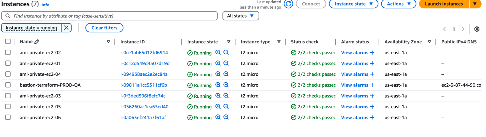

3. **Security Configuration**
    - Bastion host only accepts SSH from your IP address
    - Private instances only accept SSH from the bastion host
    
   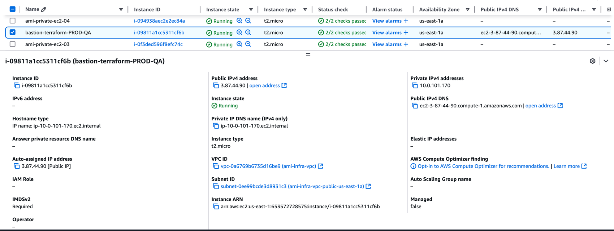
   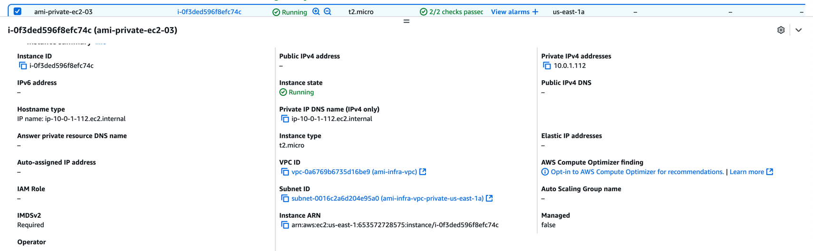
   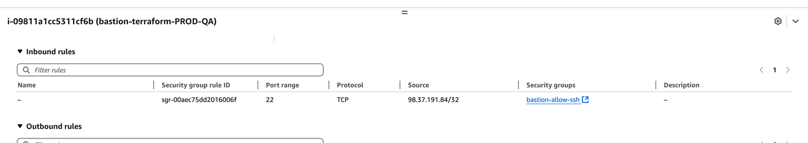
    

## Accessing Private Instances

To connect to your private EC2 instances:

1. Get the necessary DNS information:
```
terraform output
```
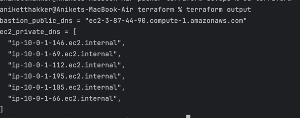

2. Add your private key to the SSH agent:
```
 ssh-add ami-key-pair.pem
```
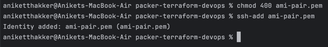

3. Connect to the bastion host with agent forwarding:
```
 ssh -A -i ami-key-pair.pem ec2-user@[bastion-host-public-dns]
```
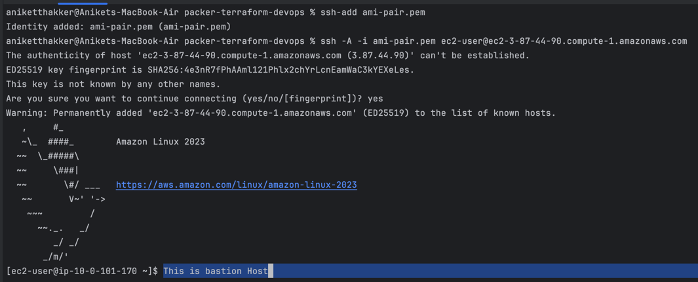

4. From the bastion host, connect to private instances:
```
 ssh ec2-user@[private-instance-dns]
```
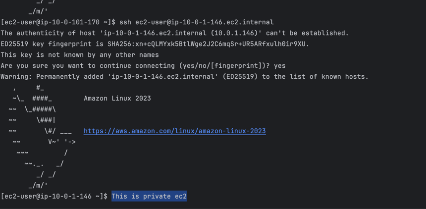

Once connected to your private instance, you can verify Docker is properly installed and ready to use.
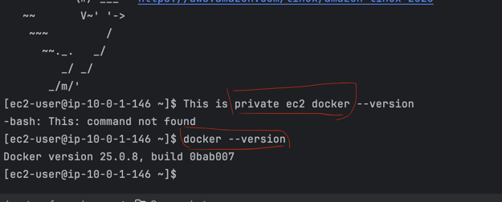
