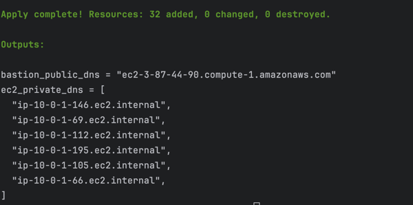

# AWS Infrastructure Setup Guide

This guide will walk you through setting up AWS infrastructure using Packer and Terraform.

## Getting Started

First, clone this repository to your local machine.

## Configure AWS Credentials

Set up your AWS credentials from AWS Academy as environment variables:
```
aws configure
aws configure set aws_session_token <YOUR TOKEN HERE>
```

## Building a Custom AMI with Packer

### Installing Packer
Verify if Packer is installed:
```
packer
```

If not installed, use Homebrew to install it:
```
brew tap hashicorp/tap
brew install hashicorp/tap/packer
```

Install the Amazon plugin:
```
packer plugins install github.com/hashicorp/amazon
```

### Creating SSH Key Pair
Generate an RSA key pair for EC2 access:
```
 aws ec2 create-key-pair \
    --key-name ami-pair \
    --key-type rsa \
    --key-format pem \
    --query "KeyMaterial" \
    --output text > ami-pair.pem
```

Set appropriate permissions for the key file:
```
 chmod 400 ami-pair.pem
```

Note: If you change the key name, update the "ssh_keypair_name" value in /packer files *.json accordingly.

### Building the AMI
Build a custom AMI with Docker and SSH public key configured:
```
 cd packer
 packer build ubuntu_ami.json
 packer build aws_ami.json
```

After completion, you'll see the new AMI ID in the output and can verify it in the AWS Console.


## Deploying Infrastructure with Terraform

### Installing Terraform
Check if Terraform is installed:
```
 terraform
```

If not installed, use Homebrew:
```
 brew tap hashicorp/tap
 brew install hashicorp/tap/terraform
```

### Provisioning Resources
Navigate to the terraform directory and run:
```
 cd ../terraform
 terraform init
 terraform plan
 terraform apply
```

### Created Resources Overview

After successful deployment, Terraform will create 3 Amazon Machines, 3 Ubuntu Machine, 1 Private Ansible Controller, 1 Bastion Host:

1. **Output**
    - All the required ips copy them somewhere or do not close the temrinal.
   


## Accessing Private Instances

To connect to your Ansible Controller:

1. Use the output above or
```
terraform output
```

2. Add your private key to the SSH agent:
```
 ssh-add ami-pair.pem
```

3. Connect to the bastion host with agent forwarding:
```
 ssh -A -i ami-pair.pem ec2-user@[bastion-host-public-dns]
```
4. Since we have setup Ansible Controller inside the private subnet we will need to copy our ami-pair.pem to the ansible controller.\
   The reason to do this is we want ansible-controller to be able to communicate with other hosts which have ami-pair.pem as the key.
   We can create a seperate SSH-key from ansible controller but then we will need to distribute the key across the hosts which will add a lot of overhead.
   We will do this instead.
   ``` 
   # Open a new local terminal in the root directory where the ami-pair key is located
   
   scp -i ami-pair.pem ami-pair.pem ec2-user@<YOUR BASTION IP>:~/
   ```

5. From the bastion host, connect to private instances:\
   This will test out if the scp from the above step is sucessful or not
   ```
   ssh -i ami-pair.pem ec2-user@<YOUR ANSIBLE CONTROLLER IP>
   ```

6. Now we need to scp the ami-pair to the ansible controller.
   ```
   scp -i ami-pair.pem ami-pair.pem ec2-user@10.0.1.112:~/
   ```
7. Test if ansible contoller has the ami-pair file.
   
   Now we need to test if ansible controller can connect to other instances in private subnet using the key.
   ```
   mkdir -p ~/.ssh
   chmod 700 ~/.ssh
   chmod 700 ~/ami-pair.pem
   
   # Copy the key to the right location
   cp ~/ami-pair.pem ~/.ssh/ 
   cd .ssh
   chmod 400 ami-pair.pem
   
   ssh -i ami-pair.pem ec2-user@<YOUR AMAZON LINUX PRIVATE DNS>
   exit (From your private machine and back to Ansible Controller)
   
   ssh -i ami-pair.pem ubuntu@<YOUR UBUNTU PRIVATE DNS>
   exit (From your private machine and back to Ansible Controller)
   ```
8. On the Ansible Controller We need to create the ansible directory structure:
   ```
   mkdir -p ~/ansible/inventory ~/ansible/playbooks
   ```
9. Before copying the contents of the file located in the repo under /ansible/ edit the ips that were shown during the terraform process.
   ```
   nano ~/ansible/inventory/hosts.ini
   
   # Copy the contents of the repo ~/ansible/inventory/hosts.ini into the Ansible-Controller Terminal.
   ```
10. Now in the ansible folder in the repo copy-paste the contents of file ansible.cfg as is to the ANSIBLE CONTROLLER EC2 TERMINAL.
   ```
   nano ~/ansible/ansible.cfg
   COPY-PASTE the contents from the file in the repo to the ansible controller terminal.
   
   ********* OR **********

   cat > ~/ansible/ansible.cfg << 'EOF'
   [defaults]
   inventory = ~/ansible/inventory/hosts.ini
   host_key_checking = False
   EOF
   ```
11. Test the ansible connectivity
   ```
   cd ~/ansible
   ansible all -m ping
   ```
   
   

12. Create Playbook.
   ```
   nano ~/ansible/playbooks/manage_ec2.yml

   # Copy the contents of the repo /ansible/playbooks/manage_ec2.yml into the Ansible-Controller Terminal. 
   ```
   

13. Run the playbook.
   ```
   cd ~/ansible
   ansible-playbook playbooks/manage_ec2.yml
   ```
   
Once run you will see the exact details if the docker is installed on the AMI it will check for updates and update it to the latest version.\
For testing this feature out i did manually remove the docker from the AMI for amazon machines but have added them back to the packer .sh so it will run fine.\
Also we can see each instances disk usage as well.


